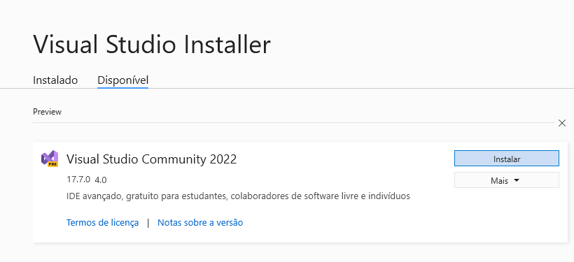
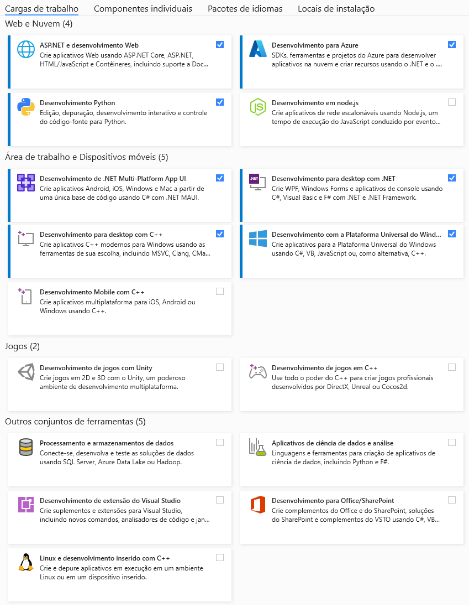

# Instalando a IDE e Ferramentas

Neste tutorial, vamos guiá-lo através do processo de instalação do Visual Studio. Existem 3 opções de versões da IDE: *Community*, *Professional*, e *Enterprise*. A Versão Community ou Communidade é gratuita e voltada para estudantes, professores, e profissionais liberais. Já a versão Professional é voltada para profissionais independentes e pequenas empresas (com menos de 10 programadores, por exemplo). Já a versão Enterprise é voltada para grandes empresas e fábricas de software. A principal diferença entre as versões está no nível de Suporte que a Microsoft ofecere e na quantidade de profissionais que podem utilizar as ferramentas de trabalho em equipe simultaneamente, que a IDE consegue suportar. De forma geral, o Visual Studio é uma poderosa ferramenta de desenvolvimento integrado (IDE) fornecida pela Microsoft. Iremos trabalhar com a versão Community neste tutorial, mas você pode usar as outras versões se a empresa para qual trabalha as oferecer. Assumindo que você ainda não tenha o VS 2022 Community instalado, vamos baixar o programa instalador do Visual Studio 2022 para instalar a IDE.

## Passo 1: Download do Instalador

Acesse o site oficial da Microsoft (https://visualstudio.microsoft.com/pt-br/vs/community/) e clique no botão "Baixar para Windows" ou para o sistema operacional que esteja usando (Linux ou MAC). Isso iniciará o download do instalador do Visual Studio Community para o seu computador. Caso deseja outra versão, clique no link (https://visualstudio.microsoft.com/pt-br/vs/). Veja um exemplo na imagem abaixo que mostra todas as versões.

")

## Passo 2: Executar o Instalador

Após o download, localize o arquivo "VisualStudioSetup.exe" e execute-o. Caso você esteja usando o Windows é provável que o sistema operacional solicite permissão de Administrador. Isso é importante para garantir que o processo de instalação tenha as permissões necessárias. Irá se abrir a tela do instalador disponibilizando as versões Release e Preview. Você deve escolar a versão Release que é a versão oficial.

Observação 1: A versão Preview é uma versão Beta com recursos no estágio de teste que deve ser usado apenas por quem deseja experimentar os futuros lançamentos. Você não deve usar a versão Preview para desenvolver produtos para os seus clientes ou usuários.

Após escolher a versão release você deverá escolher quais pacotes de ferramentas deseja utilizar nos seus projetos.

## Passo 3: Escolher Componentes

Na tela inicial do instalador, você verá uma lista de cargas de trabalho e componentes individuais disponíveis para instalação. As "cargas de trabalho" são conjuntos de ferramentas e recursos destinados a tipos específicos de desenvolvimento, como: Desenvolvimento web, Desenvolvimento .Net Multiplataforma App UI (MAUI), desenvolvimento para desktop, desenvolvimento plataforma Universal do Windows, Processamento e armazenamento de dados, etc. Selecione as cargas de trabalho e os componentes que atendam às suas necessidades e clique em "Instalar durante o download" para continuar. Voce pode escolher também a opção "baixar tudo, depois instalar".

Muitos desses componentes são pesados (baixar alguns GB) e também ocupam muito espaço em disco, então selecione eles de acordo com sua velocidade de Internet e observando quanto tempo vai espaço em disco vai ocupar. Sempre que precisar, voce pode voltar para o aplicativo Installer que já vai estar instalado no seu computador e poderá clicar em "Modificar" para adicionar ou remover componentes. Caso voce precise de um componente específico poderá procurar ele em "Componentes Adicionais" e instalar esse componente.

## Passo 4: Configurações Adicionais (opcional)

Você pode personalizar algumas configurações durante a instalação, como o pacote de idiomas e o local da instalação, temas e outras opções. Se desejar, faça as alterações necessárias e clique em "Instalar durante o download" para prosseguir.

## Passo 5: Aguardar a Instalação

O instalador começará a baixar e instalar os componentes selecionados. O tempo de instalação pode variar dependendo das opções escolhidas e da velocidade da sua conexão com a internet. Aguarde até que a instalação seja concluída.

## Passo 6: Concluir a Instalação

Após a instalação estar completa, você verá uma tela informando que o Visual Studio Community foi instalado com sucesso. Clique no botão "Iniciar" para abrir o IDE.

## Passo 7: Configuração Inicial

Na primeira execução, o Visual Studio Community pode solicitar algumas configurações iniciais, como a seleção de um tema de cores e a personalização da experiência do usuário. Faça as configurações de acordo com suas preferências.

Parabéns! Agora você tem o Visual Studio Community instalado em seu computador e está pronto para começar a desenvolver seus projetos. O Visual Studio Community oferece uma ampla gama de recursos e ferramentas poderosas para aprimorar sua produtividade no desenvolvimento de software. Explore a documentação, tutoriais e a comunidade para tirar o máximo proveito dessa excelente ferramenta de desenvolvimento. Happy coding!
